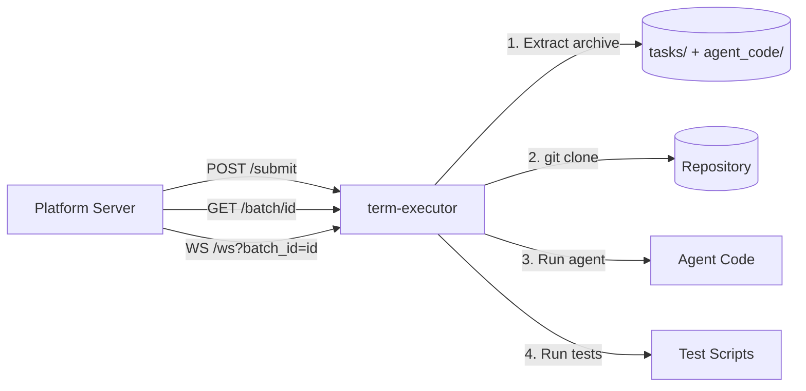
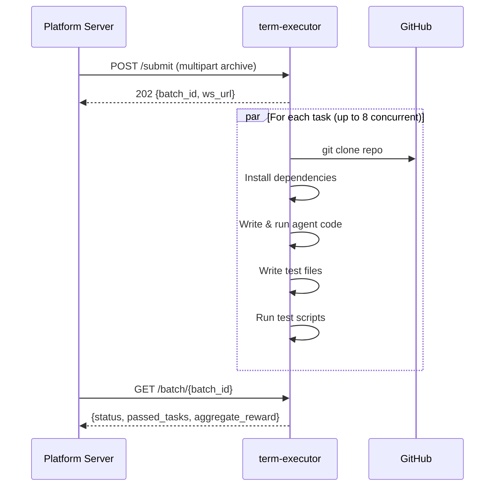

# term-executor

Remote evaluation executor for [term-challenge](https://github.com/PlatformNetwork/term-challenge). Runs as a containerized service that receives task archives, executes agent code against SWE-bench repositories, and runs validation tests.

## Architecture



## Evaluation Flow



## Authentication

Only a single authorized hotkey can submit tasks. The hotkey must be sent via the `X-Hotkey` HTTP header:

```
X-Hotkey: 5GziQCcRpN8NCJktX343brnfuVe3w6gUYieeStXPD1Dag2At
```

Health, status, and metrics endpoints are public.

## API Reference

### Health Check

```
GET /health
→ 200 {"status": "ok"}
```

### System Status

```
GET /status
→ 200 {
    "version": "0.2.0",
    "uptime_secs": 3600,
    "active_batches": 1,
    "total_batches": 10,
    "completed_batches": 9,
    "tasks_passed": 45,
    "tasks_failed": 5,
    "max_concurrent_tasks": 8,
    "has_active_batch": true
  }
```

### Prometheus Metrics

```
GET /metrics
→ 200 (text/plain)
  term_executor_batches_total 10
  term_executor_batches_active 1
  term_executor_batches_completed 9
  term_executor_tasks_passed 45
  term_executor_tasks_failed 5
  ...
```

### Submit Batch

Upload a multipart archive containing `tasks/` and `agent_code/` directories.

```
POST /submit
X-Hotkey: 5GziQCcRpN8NCJktX343brnfuVe3w6gUYieeStXPD1Dag2At
Content-Type: multipart/form-data

Field: archive (file)

→ 202 {
    "batch_id": "uuid",
    "total_tasks": 5,
    "concurrent_tasks": 8,
    "ws_url": "/ws?batch_id=uuid"
  }
→ 400 (invalid archive)
→ 401 (unauthorized)
→ 503 (batch already running)
```

Optional query parameter: `?concurrent_tasks=4` to limit concurrency.

### Get Batch Status

```
GET /batch/{batch_id}
→ 200 {
    "batch_id": "uuid",
    "status": "completed",
    "total_tasks": 5,
    "completed_tasks": 5,
    "passed_tasks": 4,
    "failed_tasks": 1,
    "aggregate_reward": 0.8,
    "error": null,
    "duration_ms": 120000
  }
→ 404 (not found)
```

### Get Batch Tasks

```
GET /batch/{batch_id}/tasks
→ 200 {
    "batch_id": "uuid",
    "tasks": [
      {
        "task_id": "task-1",
        "status": "completed",
        "passed": true,
        "reward": 1.0,
        "test_output": "...",
        "error": null,
        "duration_ms": 25000
      }
    ]
  }
```

### Get Single Task

```
GET /batch/{batch_id}/task/{task_id}
→ 200 {
    "task_id": "task-1",
    "status": "completed",
    "passed": true,
    "reward": 1.0,
    "test_results": [
      {"name": "test_1.sh", "passed": true, "exit_code": 0, "output": "..."}
    ],
    "test_output": "...",
    "error": null,
    "duration_ms": 25000
  }
```

### List All Batches

```
GET /batches
→ 200 [
    {"batch_id": "uuid", "created_at": "2024-01-01T00:00:00Z", "status": "completed"}
  ]
```

### WebSocket (Real-time Updates)

```
WS /ws?batch_id={batch_id}
```

On connect, receives a `snapshot` event with current state. Then streams events:

```json
{"event": "task_started", "batch_id": "uuid", "task_id": "task-1", "data": {"task_id": "task-1"}}
{"event": "task_complete", "batch_id": "uuid", "task_id": "task-1", "data": {"task_id": "task-1", "status": "completed", "passed": true, "reward": 1.0}}
{"event": "batch_complete", "batch_id": "uuid", "data": {"status": "completed", "total": 5, "passed": 4, "failed": 1, "reward": 0.8, "duration_ms": 120000}}
```

## Archive Format

Upload a `.zip` or `.tar.gz` archive with this structure:

```
archive/
├── tasks/
│   ├── task-1/
│   │   ├── workspace.yaml    # Required: repo URL, version, base_commit, install commands
│   │   ├── prompt.md         # Required: task description
│   │   ├── checks.txt        # Optional: test commands (one per line)
│   │   └── tests/
│   │       ├── test_1.sh     # Test scripts (exit 0 = pass)
│   │       └── helper.py     # Non-.sh files written to repo
│   └── task-2/
│       ├── workspace.yaml
│       ├── prompt.md
│       └── tests/
│           └── test_1.sh
└── agent_code/
    └── agent.py              # Agent code (never exposed in API responses)
```

### workspace.yaml

```yaml
repo: "https://github.com/psf/requests"
version: "v2.31.0"
base_commit: "abc123def"
language: "python"
install:
  - "pip install -e ."
  - "pip install pytest"
```

## Reward

Binary reward per task:
- **1.0** if all test scripts exit with code 0
- **0.0** otherwise

Aggregate reward is the mean across all tasks in the batch.

## Configuration

All configuration is via environment variables:

| Variable | Default | Description |
|----------|---------|-------------|
| `PORT` | `8080` | HTTP listen port |
| `SESSION_TTL_SECS` | `7200` | Max batch lifetime before reaping |
| `MAX_CONCURRENT_TASKS` | `8` | Maximum parallel task executions |
| `CLONE_TIMEOUT_SECS` | `180` | Git clone timeout |
| `AGENT_TIMEOUT_SECS` | `600` | Agent execution timeout |
| `TEST_TIMEOUT_SECS` | `300` | Test suite timeout |
| `MAX_ARCHIVE_BYTES` | `524288000` | Max upload archive size (500MB) |
| `MAX_OUTPUT_BYTES` | `1048576` | Max captured output per command (1MB) |
| `WORKSPACE_BASE` | `/tmp/sessions` | Base directory for task workspaces |

## Docker

```bash
docker build -t term-executor .
docker run -d -p 8080:8080 term-executor
```

The Dockerfile uses a multi-stage build. The only entrypoint is the `term-executor` binary.

## Development

```bash
# Build
cargo build

# Test
cargo test

# Run locally
PORT=8080 cargo run

# Format
cargo +nightly fmt

# Lint
cargo +nightly clippy -- -D warnings
```

## Security

- **Auth**: Only the hardcoded authorized hotkey (SS58 address) can submit batches via `X-Hotkey` header.
- **Agent code hidden**: Agent code is never returned in any API response.
- **Timeouts**: Clone, agent, and test phases each have configurable timeouts.
- **Output truncation**: Command output is capped at 1MB.
- **Session reaping**: Expired batches are cleaned up every 60 seconds.
- **Single batch**: Only one batch can run at a time, preventing resource exhaustion.

## License

Apache-2.0
