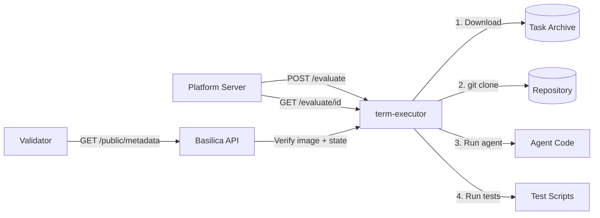
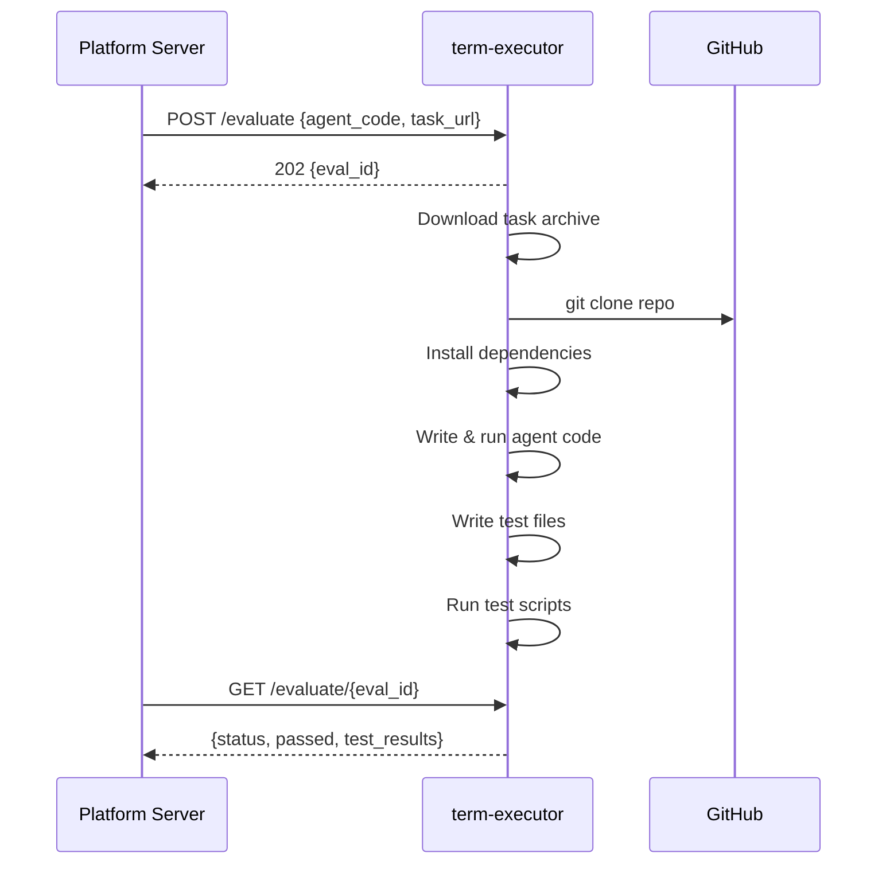
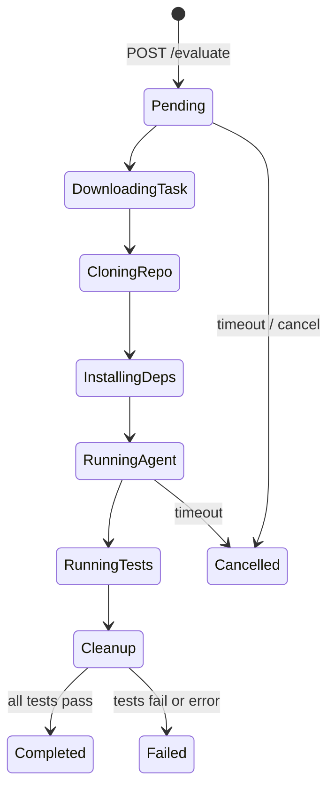

# term-executor

Remote evaluation executor for [term-challenge](https://github.com/PlatformNetwork/term-challenge). Runs on [Basilica](https://basilica.ai) as a containerized service that receives agent code, executes it against a task repository, and runs validation tests.

## Architecture



## Evaluation Flow



## Session Lifecycle



## API Reference

### Health Check

```
GET /health
→ 200 {"status": "ok"}
```

### System Status

```
GET /status
→ 200 {
    "version": "0.1.0",
    "uptime_secs": 3600,
    "active_evals": 2,
    "total_evals": 150,
    "passed": 120,
    "failed": 28,
    "cancelled": 2,
    "capacity": 4,
    "available_slots": 2
  }
```

### Prometheus Metrics

```
GET /metrics
→ 200 (text/plain)
  term_executor_evaluations_total 150
  term_executor_evaluations_passed 120
  term_executor_evaluations_failed 28
  term_executor_evaluations_active 2
  ...
```

### Submit Evaluation

```
POST /evaluate
Authorization: Bearer <token>
Content-Type: application/json

{
  "agent_code": "import os\n...",
  "agent_language": "python",
  "task_url": "https://example.com/task.tar.gz",
  "timeout_secs": 600
}

→ 202 {"eval_id": "uuid"}
→ 400 (invalid input)
→ 401 (bad token)
→ 503 (at capacity)
```

### Poll Evaluation

```
GET /evaluate/{eval_id}

→ 200 {
    "eval_id": "uuid",
    "status": "completed",
    "step": "done",
    "passed": true,
    "test_results": [
      {"name": "test_1.sh", "passed": true, "exit_code": 0, "output": "..."}
    ],
    "agent_output": "...",
    "test_output": "...",
    "error": null,
    "duration_ms": 45000
  }
→ 404 (not found)
```

### List Evaluations

```
GET /evaluations
→ 200 [{"eval_id": "...", "task_url": "...", "language": "python", "created_at": "..."}]
```

## Deployment

### Basilica (recommended)

```bash
basilica deploy ghcr.io/platformnetwork/term-executor:latest \
  --name my-executor \
  --port 8080 \
  --public-metadata \
  --health-path /health \
  --health-initial-delay 10 \
  --cpu 2 --memory 4Gi \
  --env AUTH_TOKEN=your-secret-token \
  --env MAX_CONCURRENT_EVALS=4
```

### Docker

```bash
docker run -d \
  -p 8080:8080 \
  -e AUTH_TOKEN=your-secret-token \
  ghcr.io/platformnetwork/term-executor:latest
```

## Configuration

All configuration is via environment variables:

| Variable | Default | Description |
|----------|---------|-------------|
| `PORT` | `8080` | HTTP listen port |
| `AUTH_TOKEN` | *(none)* | Bearer token for `/evaluate` endpoint. If unset, auth is disabled |
| `SESSION_TTL_SECS` | `1800` | Max session lifetime before reaping |
| `MAX_CONCURRENT_EVALS` | `4` | Maximum parallel evaluations |
| `DISK_QUOTA_MB` | `2048` | Max disk per session |
| `CLONE_TIMEOUT_SECS` | `120` | Git clone timeout |
| `AGENT_TIMEOUT_SECS` | `600` | Agent execution timeout |
| `TEST_TIMEOUT_SECS` | `300` | Test suite timeout |
| `MAX_AGENT_CODE_BYTES` | `5242880` | Max agent code payload (5MB) |
| `MAX_OUTPUT_BYTES` | `1048576` | Max captured output per command (1MB) |
| `WORKSPACE_BASE` | `/tmp/sessions` | Base directory for session workspaces |
| `BASILICA_API_TOKEN` | *(none)* | Basilica API token for metadata enrollment |
| `BASILICA_INSTANCE_NAME` | *(none)* | Basilica deployment name for auto-enrollment |

## SWE-Forge Task Format

Tasks are archives (`.tar.gz` or `.zip`) containing:

```
workspace.yaml    # Required: repo URL, version, base_commit, install commands
prompt.md         # Required: task description (no solution hints)
original_pr.md    # Optional: raw PR body
checks.txt        # Optional: flat list of test commands (one per line)
tests/
  fail_to_pass_1.sh   # Test scripts (exit 0 = pass)
  pass_to_pass_1.sh
  test_utils.py        # Test source files written to repo
```

### workspace.yaml

```yaml
repo: "https://github.com/psf/requests"
version: "v2.31.0"
base_commit: "abc123def"
language: "python"
install:
  - "pip install -e ."
  - "pip install pytest"
```

## Security

- **Auth**: Bearer token on `/evaluate`. Health/status/metrics are public.
- **Resource limits**: Per-process memory via `ulimit`, `nice` priority lowering, output truncation at 1MB.
- **Disk quota**: Checked per session, rejects if exceeded.
- **Timeouts**: Clone, agent, and test phases each have configurable timeouts.
- **Process isolation**: Each command runs in its own process group, killed on timeout.
- **Session reaping**: Expired sessions cleaned up every 60 seconds.

## Development

```bash
# Build
cargo build

# Test
cargo test

# Run locally
AUTH_TOKEN=test PORT=8080 cargo run

# Format
cargo +nightly fmt

# Lint
cargo +nightly clippy -- -D warnings
```

## License

Apache-2.0
